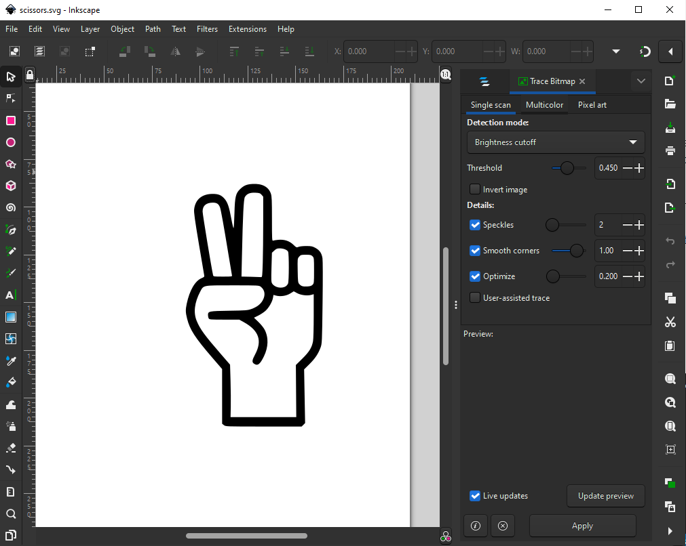
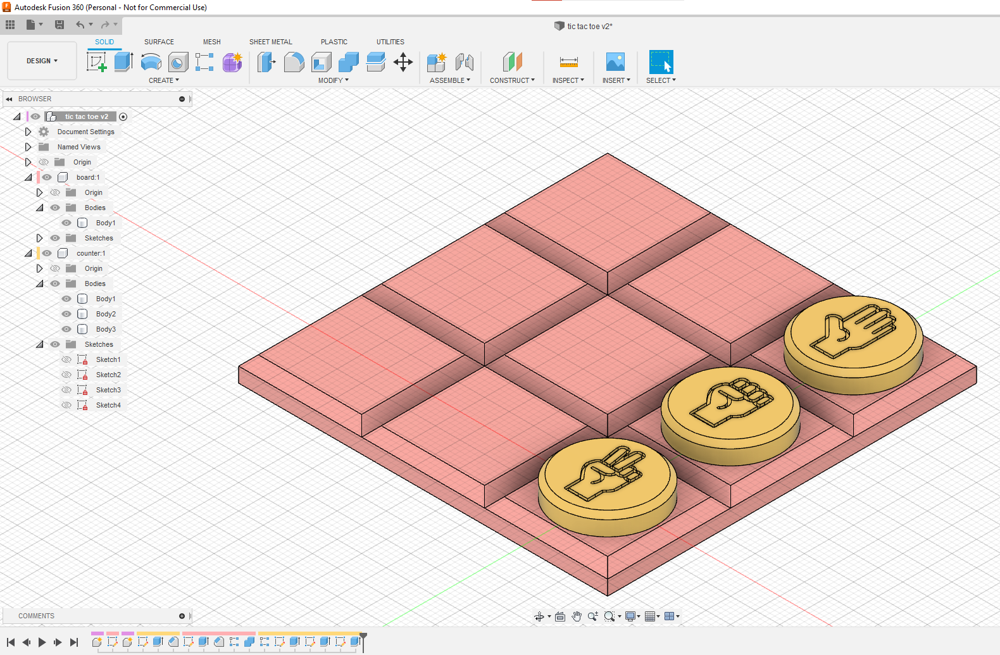
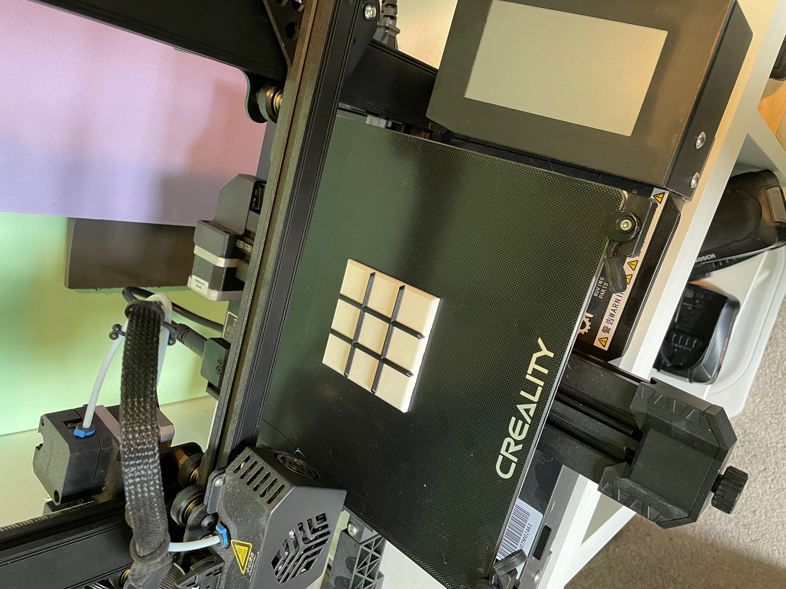
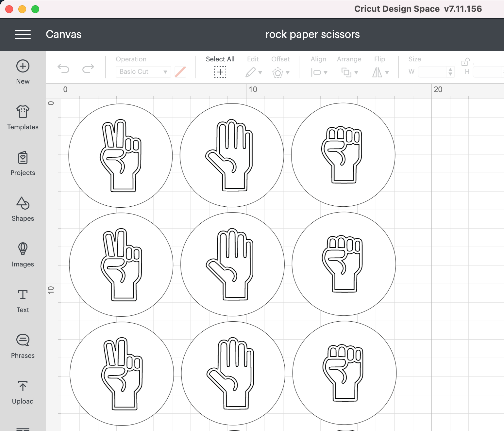
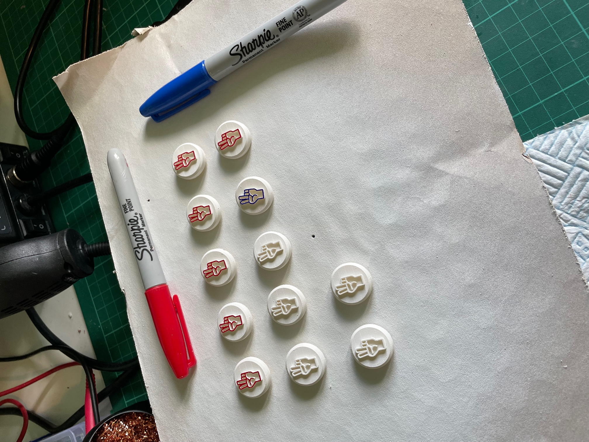

# Design & Technology Assignment - Make a Board Game

## Brief

Design and make an original board game.

## Overview

I decided to make a mashup game between Rock Paper Scissors and Tic Tac Toe. The reason I chose these games is because everyone probably already is familiar with them so explaining the new rules should be quick and easy to understand.

The premise of the game is to play Rock Paper Scissors using a Tic Tac Toe board. Instead of playing X and O players put down tokens with a Rock, Paper, or Scissors symbol and try to make a line three tokens all of their chosen colour. Unlike regulr Tic Tac Toe the opponent can take a space already used if they beat the Rock Paper Scissors symbol.

The symbols available to the players will be dictated by a card hand and deck.

[Full instructions for how to play the game](how-to-play.md)

## Design & Build

I have use of a 3D printer and a cutting machine so I decided to print the board and use the cutting machine to make the cards and tokens.

I found images of Rock Paper Scissors hands on the internet and converted them to SVG using InkScape.

I designed the board using AutoDesk Fusion 360. I picked dimensions that would keep the board pocket-sized.

I printed the board and divider in different colours to make it visually appealing.

I used the same images to make the card deck using Cricut Design Space. I chose to use circular cards for continuity with the tokens.

After 3D printing the tokens, I painted them white and used a Sharpie to color in the icons.

## Learning

In hindsight I should have made everything a little bit bigger, the tokens are fiddly to place and pick up. The base could also be heavier to add a bit more stability.

The 3D printed tokens were time consuming to print and paint, maybe paper tokens would have been quicker and easier.

Overlal this was a fun project. Thinking about game design and what a game needs to make it intuitive and playable was interesting.
